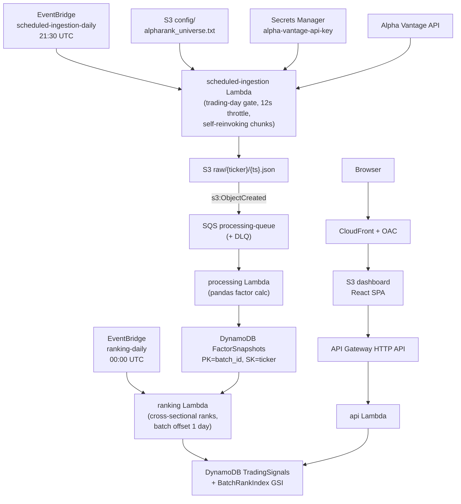

# AlphaRank

**An event-driven quantitative signal engine on AWS.** AlphaRank ingests daily market data, computes factor scores, ranks a universe of stocks cross-sectionally, and serves the results through a hedge-fund-style dashboard - all on serverless, free-tier AWS infrastructure provisioned with Terraform.

**Live demo:** https://diotz6rfs5dzh.cloudfront.net


> **Disclaimer:** AlphaRank is a personal learning project built to demonstrate event-driven architecture on AWS. The signals are a naive factor model and are **not investment advice** and **not validated** for live trading.


## Overview

Every trading day after the US market close, AlphaRank:

1. Fetches daily OHLCV data for a curated 25-name large-cap universe from Alpha Vantage.
2. Computes four technical factors per ticker (trend, momentum, volatility, mean-reversion z-score).
3. Ranks every name **cross-sectionally** (relative to its peers that day) into a 0-100 composite score.
4. Buckets each name into a signal (`STRONG_BUY` -> `STRONG_SELL`).
5. Publishes the ranked universe to a React dashboard with per-ticker historical charts and a date/batch selector.

The whole pipeline is event-driven and serverless: nothing runs except in response to a schedule or an S3 event, and the entire stack fits inside the AWS free tier (~$0/month).

## Architecture



### Data flow

1. **Ingestion (scheduled).** An EventBridge cron (`21:30 UTC`, after market close) invokes the `scheduled-ingestion` Lambda. It first checks a self-contained NYSE trading calendar and exits immediately on weekends/holidays. It loads the ticker universe from S3, then fetches each ticker from Alpha Vantage, throttling one call every 12 seconds to respect the free-tier rate limit. Because the throttled loop can exceed the Lambda timeout, the function processes the universe in chunks and **re-invokes itself asynchronously** for the next chunk. Each response is written to `s3://.../raw/{ticker}/{timestamp}.json`.
2. **Processing (event-driven).** Each new `raw/` object emits an `s3:ObjectCreated` event to the `processing-queue` (SQS). The `processing` Lambda reads the object, computes the four factors with pandas, and writes a row to the `FactorSnapshots` DynamoDB table keyed by `(batch_id, ticker)`.
3. **Ranking (scheduled).** A second EventBridge cron (`00:00 UTC`) invokes the `ranking` Lambda. It queries that day's snapshots, ranks them cross-sectionally into a composite score, assigns a signal bucket, and writes the results to the `TradingSignals` table (plus a `BATCHES` meta-item used for fast batch enumeration).
4. **Serving.** A React SPA hosted on S3 + CloudFront calls an API Gateway HTTP API backed by a read-only `api` Lambda, which queries `TradingSignals` (via the `BatchRankIndex` GSI) to return the latest universe, any historical batch, and per-ticker history.

## AWS services used

| Service | Role |
| --- | --- |
| **Lambda** (x5) | `ingestion`, `scheduled-ingestion`, `processing`, `ranking`, `api` |
| **S3** (x2) | `market-data` (raw JSON + ticker config), `dashboard` (static React build) |
| **SQS** (x2 + DLQs) | `ingestion-queue`, `processing-queue`, each with a dead-letter queue (`maxReceiveCount = 3`) |
| **DynamoDB** (x2) | `FactorSnapshots` (per-day factors), `TradingSignals` (+ `BatchRankIndex` GSI) |
| **EventBridge** (x2) | `scheduled-ingestion-daily`, `ranking-daily` cron rules |
| **Secrets Manager** | `alpha-vantage-api-key` |
| **API Gateway** | HTTP API (`$default` stage) fronting the read Lambda |
| **CloudFront + OAC** | HTTPS CDN for the dashboard; Origin Access Control locks the S3 bucket private |
| **IAM** | Least-privilege policies per function |
| **AWS Budgets** | $1/month cost guardrail with an 80% forecast alert |
| **Lambda Layer** | Shared pandas/numpy layer for the processing and ranking functions |

## The signal model

Factors are computed in [lambdas/processing/handler.py](lambdas/processing/handler.py) from daily closes:

- **Trend** = `(SMA20 - SMA50) / SMA50`
- **Momentum** = `close[-1] / close[-5] - 1`
- **Volatility** = `std(daily returns, 20d)`
- **Z-score** = `(close - SMA20) / std20`

Ranking is done in [lambdas/ranking/handler.py](lambdas/ranking/handler.py). Each factor is converted to a cross-sectional percentile rank (trend and momentum higher-is-better; volatility and z-score inverted), then combined:

```
composite = 0.4*trend_rank + 0.3*momentum_rank + 0.2*volatility_rank + 0.1*zscore_rank
```

The composite is itself percentile-ranked to `0-100` and bucketed:

| Composite rank | Signal |
| --- | --- |
| >= 90 | `STRONG_BUY` |
| 70 - 90 | `BUY` |
| 30 - 70 | `HOLD` |
| 10 - 30 | `SELL` |
| <= 10 | `STRONG_SELL` |

Because ranks are **cross-sectional**, a signal expresses how a name looks *relative to its peers that day*, not against an absolute threshold.

## Repository structure

```
.
├── lambdas/
│   ├── ingestion/            # SQS-triggered single-ticker fetch (per-message path)
│   ├── scheduled_ingestion/  # EventBridge batch fetch + trading_calendar.py
│   ├── processing/           # S3/SQS-triggered pandas factor computation
│   ├── ranking/              # Cross-sectional ranking + trading_calendar.py
│   └── api/                  # Read API over DynamoDB (API Gateway proxy)
├── terraform/                # All infrastructure as code (main.tf)
├── frontend/                 # React + Vite + TypeScript dashboard
├── config/                   # alpharank_universe.txt (curated 25-name universe)
└── layer/                    # pandas/numpy Lambda layer source
```

## Deploy / run locally

**Prerequisites:** an AWS account with credentials configured, [Terraform](https://developer.hashicorp.com/terraform), Node 18+, and a (free) [Alpha Vantage API key](https://www.alphavantage.co/support/#api-key).

1. **Provision infrastructure**

   ```bash
   cd terraform
   terraform init
   terraform apply
   ```

   Note the `api_base_url`, `dashboard_url`, and `dashboard_bucket` outputs.

2. **Seed the Alpha Vantage key** into the Secrets Manager secret created by Terraform:

   ```bash
   aws secretsmanager put-secret-value \
     --secret-id alpha-vantage-api-key \
     --secret-string '{"api_key":"YOUR_KEY"}'
   ```

3. **Build and deploy the dashboard**

   ```bash
   cd frontend
   npm install
   echo "VITE_API_BASE_URL=$(terraform -chdir=../terraform output -raw api_base_url)" > .env.production
   npm run build
   aws s3 sync dist/ "s3://$(terraform -chdir=../terraform output -raw dashboard_bucket)/" --delete
   aws cloudfront create-invalidation --distribution-id <DIST_ID> --paths "/*"
   ```

4. **(Optional) trigger a run manually** instead of waiting for the cron:

   ```bash
   aws lambda invoke --function-name scheduled-ingestion-lambda --invocation-type Event /dev/null
   # ...after ingestion + processing complete:
   aws lambda invoke --function-name ranking-lambda \
     --payload '{"batch_id":"2026-06-05"}' --cli-binary-format raw-in-base64-out /dev/stdout
   ```

> The cost-alert email is exposed as the `budget_alert_email` Terraform variable. Override it (`-var budget_alert_email=you@example.com`) or set it to `""` to disable alerts.

## Design decisions / notable engineering

- **Cross-sectional percentile ranking** rather than absolute thresholds, so signals are robust to market-wide regime shifts.
- **Schedule/date alignment.** Ranking runs at `00:00 UTC` for an ingestion that started the prior evening, so the ranking Lambda derives its `batch_id` via `RANKING_BATCH_OFFSET_DAYS` to look back one UTC day instead of ranking an empty "today."
- **Trading-calendar gating.** A dependency-free `trading_calendar.py` (weekends + NYSE holidays with observance rules) lets both ingestion and ranking exit early on non-trading days, avoiding wasted API calls and duplicate signals.
- **Rate-limit-aware ingestion.** The scheduled fetcher throttles one call per 12s and **re-invokes itself in chunks** so a long throttled loop never hits the Lambda timeout.
- **Single-table DynamoDB design** with a `BatchRankIndex` GSI and a `BATCHES` meta-item, so the API lists and queries batches without ever scanning.
- **Fault tolerance.** Both SQS queues have dead-letter queues with `maxReceiveCount = 3` so poison messages are isolated rather than retried forever.
- **Security & cost.** Secrets live in Secrets Manager, the dashboard bucket is private behind CloudFront OAC, IAM policies are scoped per function, and an AWS Budgets alarm guards against surprise spend.

## Cost

At this scale everything stays within the AWS always-free / 12-month-free tiers:

- **Lambda / DynamoDB on-demand / SQS** - a handful of invocations and writes per day, far under free-tier limits.
- **S3 + CloudFront** - a few MB of static assets and minimal egress.
- **API Gateway** - well under the 1M-requests free allotment.

Practical run cost: **~$0/month**, backstopped by a $1/month AWS Budgets alert.

## Limitations & future work

The architecture is the point of this project; the signal is intentionally simple. Honest caveats and a roadmap:

- **No out-of-sample validation.** The single highest-value next step is a backtesting harness that measures the Information Coefficient (correlation of today's score with forward returns) so the ratings can be judged rather than trusted blindly.
- **Better factor construction** - winsorize + z-score standardize, swap 5-day for 12-1 month momentum, and sector-neutralize so the signal isn't a disguised sector bet.
- **CI/CD** - GitHub Actions to lint/test, `terraform plan` on PRs, and gate the frontend build/deploy.
- **Observability** - CloudWatch dashboards and alarms (e.g. "ranking wrote 0 signals on a trading day"), structured logging, and X-Ray tracing across the pipeline.
- **Data-intensive layer** - write snapshots as Parquet (PyArrow) and query with Polars/Athena.
